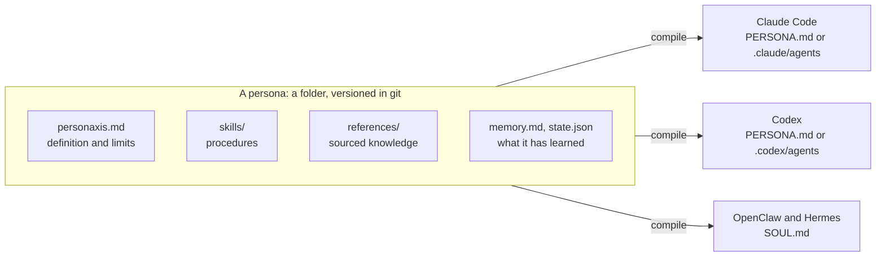

# PERSONA.md

An open file format for the complete way a professional works, so any agent can do the job the same way.

[](https://github.com/personaxis/persona.md/actions/workflows/ci.yml)
[](./docs/SPEC.md)
[](./LICENSE)
[](https://github.com/personaxis/personaxis)

Most of what an agent knows about how to do a job sits in a system prompt: incomplete, tied to one
platform, and impossible to check. A persona puts the same material in a folder of plain files with a
schema, so it can be validated, diffed in git, reviewed like code, and loaded by whichever agent you use.



## What a persona contains

| It has | Where it lives |
|---|---|
| Procedures it follows | `skills/<name>/SKILL.md`, listed in `extensions.skills` |
| Criteria it judges its work by | `character.behavioral_commitments`, `persona.behavioral_anchors`, `verification.gates` |
| Tools it uses | `extensions.tools`, `cognition.tool_use_policy`, `permissions` |
| Knowledge it relies on, with sources | `references/`, listed in `extensions.references` |
| What it has learned | `memory.md`, `memory/` |
| Behavior and limits | the ten layers and the governance blocks of `personaxis.md` |

`personaxis.md` is YAML frontmatter checked against a [JSON Schema](./schema/persona.schema.json), plus a
Markdown body that explains the choices. Everything else is a normal file in a normal folder.

## A persona on one screen

A code reviewer, cut down to the parts that carry the way of working. The remaining layers are required
in a real file and are omitted here.

```yaml
# .personaxis/personas/lens/personaxis.md
---
apiVersion: personaxis.com/v1
kind: AgentPersona
spec_version: "1.1.0"

metadata:
  name: "lens"
  version: "1.0.0"
  description: "Reviews pull requests for correctness first and style second."

character:
  behavioral_commitments:             # the criteria it judges its own work by
    - { id: evidence-for-every-finding, rule: "Every finding names the file, the line and what the code actually does.", severity: high }
    - { id: no-silent-approval, rule: "Silence on an area is not approval; say what was not reviewed.", severity: high }
  prohibited_behaviors:
    - "Approve code with known security vulnerabilities."

extensions:
  skills: ["./skills/review-diff"]    # the procedure
  references: ["references/review-checklist.md"]
  tools: [read_file, run_command]

verification:
  gates:                              # objective checks before a review is delivered
    - { type: command, name: tests-pass, run: "pnpm test" }
---
```

```markdown
<!-- .personaxis/personas/lens/skills/review-diff/SKILL.md -->
---
name: review-diff
description: Review a pull request diff. Use when asked to review changes before merge.
---
1. Read the diff and every file it touches.
2. For each finding, name the file, the line and what the code does.
3. Rank findings by impact. Correctness and security come before style.
4. End with what you did not review.
```

## Try it

The reference implementation is the `personaxis` CLI, in [its own repository](https://github.com/personaxis/personaxis).

```bash
npx personaxis create lens --from-prompt "A code reviewer who blocks merges without tests."
npx personaxis validate lens
npx personaxis compile lens --platform claude-code
```

Every command and flag is documented in the CLI repository, starting from its
[getting started guide](https://github.com/personaxis/personaxis/blob/main/docs/guides/getting-started.md).

## The ten layers

The behavioral part of a persona is split into ten layers, each tied to a body of research and a contract
for whoever reads it. [`docs/SPEC.md`](./docs/SPEC.md) has every field.

| # | Layer | What it captures |
|---|---|---|
| 1 | `identity` | purpose, role, and the narrative that anchors continuity |
| 2 | `character` | virtues, commitments and prohibited behaviors |
| 3 | `personality` | trait ranges, as envelopes with bands |
| 4 | `values_and_drives` | weighted values, drives, conflict rules |
| 5 | `affect` | core affect and mood, as functional states |
| 6 | `cognition` | reasoning modes, uncertainty thresholds, tool policy |
| 7 | `memory` | what it remembers, and the policies for writing and deleting |
| 8 | `metacognition` | what it monitors in its own thinking |
| 9 | `self_regulation` | hard limits and the final decision on each turn |
| 10 | `persona` | voice, constraints and how it adapts to an audience |

## What is in this repository

| Path | What it is |
|---|---|
| [`docs/SPEC.md`](./docs/SPEC.md) | the normative specification: fields, tiers, universal rules, conformance classes |
| [`docs/MULTI_WRITER.md`](./docs/MULTI_WRITER.md) | what an implementation must do when one persona is written from several places |
| [`schema/`](./schema) | the JSON Schemas: persona, state, memory, and the frozen 0.10 legacy schema |
| [`PERSONA_template.md`](./PERSONA_template.md) | the section contract of the compiled document a model reads |
| [`.personaxis/`](./.personaxis) | the authoring templates and the example personas |
| [`CHANGELOG.md`](./CHANGELOG.md) | every change to the spec, and why |

## Examples

| Persona | Layout | Notes |
|---|---|---|
| [maintainer](./.personaxis/personaxis.md) | root, with its compiled [`PERSONA.md`](./PERSONA.md) | the persona that stewards this repository |
| [cmo](./.personaxis/personas/cmo/) | named persona with five skills | the outputs under `examples/` were written by hand to show the shape of each deliverable; they are not results of a run |
| [frontend-expert](./.personaxis/personas/frontend-expert/) | subagent for Claude Code | a code reviewer with one skill; the review under `examples/` was written by hand |

## Status

Spec `1.1.0` is current. It only adds optional fields to `1.0.0`, so every `1.0.0` document validates
unchanged, and documents from `0.3.0` to `0.10.0` validate against the frozen legacy schema. This
repository defines the format and states no measured gain: how much a persona improves a given model is a
measurement, not a property of the file. The CLI repository lists what has been measured and what has not.

## Contributing

Typo fixes and clarifications go straight to a pull request. A new field or a change to one starts as an
issue with the use case. See [CONTRIBUTING.md](./CONTRIBUTING.md).

## License

MIT.
